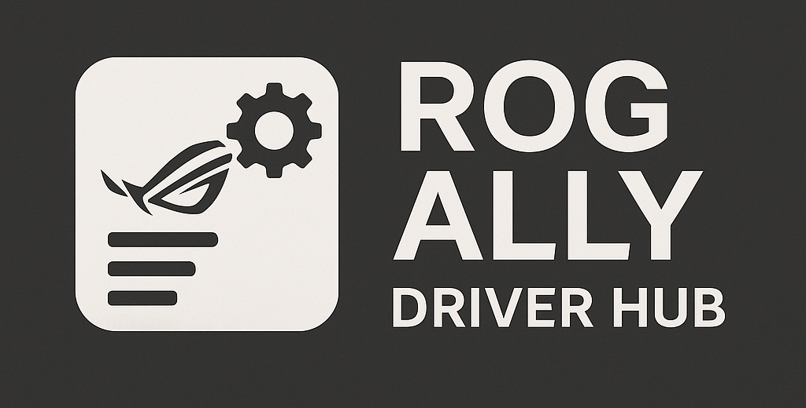

# ROG Ally Driver Hub

<p align="center">
  
</p>

<p align="center">
  <a href="#"></a>
  <a href="#"></a>
  <a href="#"></a>
</p>

The ultimate driver hub for your ROG Ally. Say goodbye to navigating confusing support pages. This powerful, browser-based tool gives you instant access to a clean, sorted, and exportable list of the latest official drivers for your device.

**[➡️ View Live Demo Here](https://8bit2qubit.github.io/rog-ally-driver-hub/)**

---

## ✨ Features

* **Purely Client-Side**: Runs entirely in your browser. No server, no data collection.
* **Real-Time Data**: Fetches the latest driver info for the **ROG Ally (2023)**, **ROG Ally X (2024)**, and other future models on demand.
* **Intelligent Grouping**: Drivers are neatly organized by their official categories (Graphics, Audio, etc.) for easy navigation.
* **Automatic Highlighting**: The latest version of each driver is automatically highlighted and sorted to the top of its category.
* **One-Click Export**: Generate and download a clean `.txt` file containing direct download links for the newest version of every driver with a single click.
* **Modern & Responsive UI**: A fluid, dark-themed interface built with Tailwind CSS that looks great on both desktop and mobile devices.

---

## 🤔 How It Works

This tool operates without a backend by leveraging a clever client-side workflow:

1.  **Proxies Requests**: Uses a CORS (Cross-Origin Resource Sharing) proxy to bypass browser security policies, allowing it to fetch data from `asus.com`.
2.  **Scrapes the Page**: When a device is selected, the app fetches the HTML from the official ASUS support page.
3.  **Constructs API URL**: The HTML is parsed with Regular Expressions to extract the necessary parameters (like product IDs) to build a valid URL for ASUS's internal driver API.
4.  **Fetches Driver Data**: A second request is made to the newly constructed API URL, retrieving the complete driver list in JSON format.
5.  **Renders the UI**: The fetched JSON data is then used to dynamically build and render the categorized, sorted, and highlighted driver list on the page.

---

## 🛠️ Local Development

To get this project running on your local machine, follow these steps.

1.  **Clone the Repository**
    ```bash
    git clone https://github.com/8bit2qubit/rog-ally-driver-hub.git
    cd rog-ally-driver-hub
    ```

2.  **Install Dependencies**
    This project uses `npm` to manage the development dependencies.
    ```bash
    npm install
    ```

3.  **Run for Development**
    This command starts a development server that watches for changes in your `src` directory (both CSS and HTML) and automatically rebuilds the necessary files in the `dist` folder.
    ```bash
    npm run dev
    ```

4.  **Build for Production**
    When you are ready to deploy, run this command to generate a one-time, optimized build. It minifies the CSS and copies the HTML to the `dist` folder.
    ```bash
    npm run build
    ```

5.  **Preview in Browser**
    Open the `dist/index.html` file in your browser. For the best experience with auto-reloading during development, use a local server extension like **Live Server** for VS Code.

---

## 💻 Tech Stack

* **Core**: HTML5, Vanilla JavaScript (DOM Manipulation, Fetch API)
* **Styling**: Tailwind CSS
* **Build Tools**:
    * `npm` - Package Manager
    * `tailwindcss` - The core CSS framework and CLI
    * `postcss` & `autoprefixer` - For CSS processing and browser compatibility
    * `chokidar-cli` - A robust file watcher for real-time updates
    * `copyfiles` - For copying assets during the build process
    * `npm-run-all` - To run multiple scripts concurrently or sequentially
* **Deployment**: GitHub Pages

---

## 📄 License

This project is licensed under the [Creative Commons Attribution-NonCommercial-ShareAlike 4.0 International License](http://creativecommons.org/licenses/by-nc-sa/4.0/).